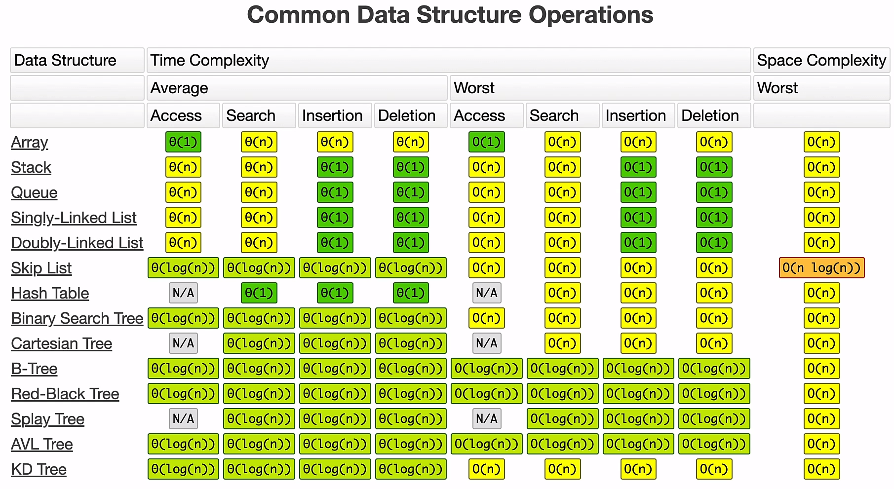

# Big O

# General Notes


- [Big O Cheatsheet](https://www.bigocheatsheet.com)

# What Is Big O?

Big O is a way of measuring how efficient your code is.

- One example of when to use this is for deciding if storing your code
  in a linked list or doubly linked list is more efficient for when
  you need to remove the last item.

Big O compares code mathematically to decide which runs faster using
**Time Complexity** and **Space Complexity**.

- **Time Complexity** is not measured in time, and is instead measured in how
  long it takes for code to complete something.
- **Space Complexity** measures the amount of space that code takes up.

# Big O: The Worst Case

When dealing with time complexity and space complexity, there's three greek
letters that are relevant:

- **Omega: Ω**
    - The Best Case Scenario
- **Theta: θ**
    - The Average Case Scenario
- **Omicron: Ο**
    - _Omicron is the 'O' in Big O_
    - The Worst Case Scenario


- If you're trying to find the number 1, you'll find it in a single operation.
  This is the **Best Case Scenario**.
- If you're trying to find the number 4, you'll find it in 4 operations. This is
  the **Average Case Scenario**.
- If you're trying to find the number 7, you'll find it in 7 operations. This is
  the **Worst Case Scenario**.

There is no "Average or worst case Big O". Those are either Theta or Omega.
Talking about Big O is always talking about worst case.

# Big O: O(n)


- **O(n)** is always going to be a straight line. This is referred to as
  **Proportional**.

```python
def print_items(n):
    for i in range(n):
        print(i)


# Prints 0 -9
print_items(10)
```

# Big O: Drop Constants

```python
def print_items(n):
    for i in range(n):
        print(i)

    for j in range(n):
        print(j)


# Prints 0 - 9 twice 
print_items(10)
```

- This ran two operations since it printed the numbers out twice. Instead of
  writing this as **O(2n)**, you'd write it as **O(n)** because you drop
  constants.

# O(n<sup>2</sup>)


- **O(n<sup>2</sup>)** is much steeper than **O(n)**. This means that it is much
  **less** efficient from a time complexity standpoint.

```python
# Example 1
def print_items(n):
    for i in range(n):
        for j in range(n):
            print(i, j)


# Prints 99 items
print_items(10)


# Example 2
def print_items(n):
    for i in range(n):
        for j in range(n):
            for k in range(n):
                print(i, j, k)


# Prints 000 - 999
print_items(10)
```

- The second example is `n * n * n` and instead of writing that as **O(n<sup>3</sup>)**,
  you'd write that as **O(n<sup>2</sup>)**.

# Drop Non-Dominants

```python
def print_items(n):
    for i in range(n):
        for j in range(n):
            for k in range(n):
                print(i, j, k)

    for k in range(n):
        print(k)


# Prints 0-99 and then 0-9
print_items(10)
```

The first loop ran **O(n<sup>2</sup>)** and the second loop ran **O(n)**. The
full equation can be written as **O(n<sup>2</sup> + n)**. Because the
**n<sup>2</sup>** would be a much larger part of the operations, it is the
**dominant** term and we would drop the **non-dominant** term. The final
equation would just be: **O(n<sup>2</sup>)**

# Big O: O(1)


- The most efficient Big O

```python
def add_items(n):
    return n + n
```

- **O(1)** is also called **Constant Time**, meaning that as it increases, the
  number of operations will remain constant as **n** increases.
- Even if there are multiple operations, you will not write it as **O(2)** or
  **O(3)**. It will always just be **O(1)**.

# Big O: O(log n)


_You have to have sorted data for this example_

**O(log n)** is a **Binary Search**. If you're searching for the number 1, it
will cut the list in half and check. It will keep cutting it in half until it
has found it.

In this scenario, it would complete in 3 operations by cutting the list in
half as follows:

1. **1, 2, 3, 4, 5, 6, 7, 8**
2. **1, 2, 3, 4**
3. **1, 2**

This can be summarized as **2<sup>3</sup>=8**. In log format, this is:
**log<sub>2</sub>8=3**.

- log format is saying 2 to what power equals 8? 
  - The sub number is the divisor and the number after is the number to be
    divided. The question is how many times the divisor needs to be multiplied
    by itself to equal the number.
- **log<sub>2</sub>1073471824=31**

# Big O: O(*n*log n)


# Big O: Different Terms for Inputs


## Example 1

```python
def print_items(a, b):
    for i in range(a):
        print(i)
        
    for j in range(b):
        print(j)
```

- This would not be **O(n)** even though it looks like **O(2n)** where you'd 
  then drop the constants. This is because **n** cannot represent both **a** 
  and **b**. The most this could be simplified to is **O(a + b)**

## Example 2
```python
def print_items(a, b):
    for i in range(a):
        for j in range(b):
            print(i, j)
        
    
```

- This would be **O(n<sup>2</sup>)**, it would be **O(a * b)**

# Big O: Lists


- `my_list.append(17)` and `my_list.pop()` are simple operations that add or
  remove a number without re-indexing the rest of the list. They are **O(1)**.
- `my_list.insert(0, 11)` and `my_list.pop(0)` both require the rest of the
  items in the list to be re-indexing. Adding or removing anywhere in a list is
  **O(n)**.
  - Even if you do so halfway through, Big O measures the worst case scenario 
    and you drop constants, so it's the same.
- Searching a list index directly is **O(1)**, because it goes straight to that
  index.

# Wrap Up

### If **n** is 100, then:


### If **n** is 1000, then:


## Terminology

- **O(n<sup>2</sup>):** Loop within a loop
- **O(n):** Proportional
- **O(log n):** Divide and Conquer
- **O(1)**: Constant

## Data Structures





- **Bubble Sort, Insertion Sort,** and **Selection Sort** are considered
  primitive.
  - If you have almost sorted or completely sorted data *(e.g. Adding a number to
    an already sorted list)*, **Quicksort** is terrible for this while **Bubble 
    Sort** and **Insertion Sort** are good.