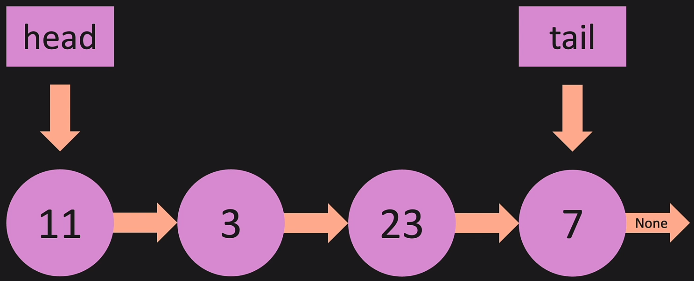

# Section 3: Linked Lists

- With normal _lists_, there are indexes and all the values are contiguous in
  memory. Neither of these are true for **Linked Lists**. Each node will be spread
  all over the place.
- There is a **head** that points to the first node, and a **tail** that points
  to the last one. The last node points to `None`.

#### How Linked Lists Appear In Memory:

# Linked Lists: Big O

## Appending a New Node

- Appending a new node to the end of a list is **O(1)**, because the tail is 
  then set to point to the new node.
- Appending a new node to the beginning **or** end of a list is **O(1)**, 
  because the tail is the head just points to the new node.
- Removing a node is **O(n)**, because the tail needs to point to the previous
  node. The only way to get back to that node is by iterating through the entire
  list to get the address.
- 